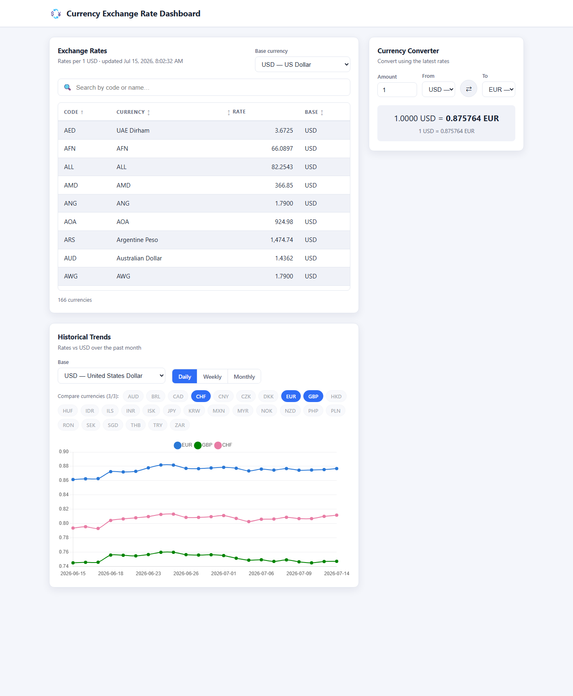

# Currency Exchange Rate Dashboard

A responsive Angular dashboard for tracking live foreign-exchange rates, comparing
historical trends, and converting between currencies. Built for the Tranglo
front-end assessment.



## Features

**Core**

- **Real-time exchange rates** — a sortable table (currency code, rate, base) with
  a selectable base currency, backed by a live public API.
- **Historical trends** — compare up to **3** currencies over the past month, with a
  **daily / weekly / monthly** aggregation toggle, drawn as a dynamic line chart.
- **Conversion calculator** — convert an amount between any two currencies using the
  latest rates (cross-rate), with a one-click swap.
- **Filtering & search** — debounced search over currency code and name.

**Advanced**

- **Dynamic theming** — light/dark toggle that persists to localStorage and follows
  the OS preference on first visit; the chart re-themes its palette and axis ink.
- **Offline mode** — last rates, history, and currency list are cached in localStorage;
  when the network is down the dashboard serves the cached snapshot and marks it "not
  live," and the calculator keeps working from local cross-rate arithmetic.

**Quality**

- Modular, standalone-component architecture with clear separation of concerns.
- Unit tests (Jasmine/Karma) for services, utilities, pipes, and components.
- E2E tests (Cypress) covering the key user flows.
- CI/CD pipeline (GitHub Actions) that lints, tests, builds, and deploys to GitHub Pages.

> **Dynamic theming and offline mode are implemented.** The last advanced feature
> (real-time polling) is planned as a follow-up phase — see [Roadmap](#roadmap).

## Tech stack

| Concern | Choice |
|---|---|
| Framework | Angular 20 (standalone components, signals, new control flow) |
| Charts | Chart.js via `ng2-charts` |
| Live rates | [ExchangeRate-API](https://www.exchangerate-api.com/) open endpoint (no key) |
| Historical data | [Frankfurter API](https://frankfurter.dev/) (no key, ECB time-series) |
| Unit tests | Jasmine + Karma |
| E2E tests | Cypress |
| Linting | ESLint (`angular-eslint`) |
| CI/CD | GitHub Actions → GitHub Pages |

## Getting started

**Prerequisites:** Node.js 20+ and npm.

```bash
npm install         # install dependencies
npm start           # dev server at http://localhost:4200
```

### Common scripts

| Command | Description |
|---|---|
| `npm start` | Run the dev server with live reload |
| `npm run build` | Production build to `dist/` |
| `npm test` | Unit tests (interactive, watch mode) |
| `npm run test:ci` | Unit tests headless, single-run, with coverage |
| `npm run lint` | Lint the project |
| `npm run e2e` | Run Cypress E2E headless (needs the app running) |
| `npm run e2e:open` | Open the Cypress interactive runner |

To run E2E locally, start the app in one terminal (`npm start`) and run
`npm run e2e` in another.

## Architecture decisions

- **Angular 20 instead of the original v13 scaffold.** The starter was Angular 13,
  which the local toolchain (Node 22) does not officially support. Upgrading to
  Angular 20 unlocks standalone components, **signals** for reactive state, and the
  new control-flow syntax — the current best-practice baseline.
- **Signals for state.** `ExchangeRateService` holds the live-rates domain state as
  signals (`rates`, `base`, `ratesMap`, `loading`, `error`); the rates table and the
  converter both read from this single source of truth via `computed` views. No
  external state library is needed.
- **Two data sources, on purpose.** ExchangeRate-API's free tier serves *latest*
  rates only, so it powers the table and calculator. The historical chart needs a
  month of daily data, so it uses Frankfurter's free `/timeseries` endpoint. Both are
  keyless, which keeps the repo free of secrets. See `src/app/core/config/api.config.ts`.
- **Aggregation is client-side and pure.** Frankfurter returns daily (weekday) points;
  `aggregation.util.ts` buckets them into weeks/months as pure, unit-tested functions,
  so no extra API calls are made when the toggle changes.
- **Reusable, generic building blocks.** `SortableTableComponent<T>` (column-driven,
  self-sorting), `CurrencySelectComponent`, `CardComponent`, `SearchFilterComponent`,
  and the loading/error components live in `shared/` and are composed by the feature
  components.
- **Accessible, validated chart colors.** The 3 series colors are a colorblind-safe
  categorical set validated for both light and dark surfaces; identity is reinforced
  by an always-present legend, never color alone.

## Project structure

```
src/app/
  core/                     # app-wide, non-visual concerns
    config/                 # API endpoints & constants
    models/                 # typed interfaces + currency name map
    services/               # exchange-rate, historical, conversion
  shared/                   # reusable, presentational building blocks
    components/             # sortable-table, currency-select, card, spinner, error
    pipes/                  # rate-format
    utils/                  # sort, date, aggregation (pure, tested)
  features/                 # one folder per feature
    rates-table/            # Feature 1 + 4 (rates + search/filter)
    historical-trends/      # Feature 2
    conversion-calculator/  # Feature 3
    search-filter/          # reusable search box
  dashboard/                # composition root that lays out the features
cypress/                    # E2E specs, fixtures, config
.github/workflows/ci.yml    # CI/CD pipeline
```

## APIs

- **Latest rates:** `GET https://open.er-api.com/v6/latest/{BASE}` — returns
  `{ base_code, time_last_update_unix, rates: { CODE: number } }`.
- **Historical series:** `GET https://api.frankfurter.dev/v1/{start}..{end}?base={BASE}&symbols={CSV}`
  — returns `{ base, rates: { "YYYY-MM-DD": { CODE: number } } }`.
- **Supported currencies:** `GET https://api.frankfurter.dev/v1/currencies`.

Network errors surface as inline, retryable messages; the app never crashes on a
failed request.

## Testing

- **Unit** (`npm run test:ci`) — 44 specs covering services (mocked `HttpClient`),
  pure utils, the rate-format pipe, and components; ~97% statement coverage.
- **E2E** (`npm run e2e`) — Cypress drives table load/sort, search, conversion, the
  swap action, chart rendering, the aggregation toggle, and the 3-currency limit.
  Network is stubbed with fixtures for deterministic runs.

## CI/CD

`.github/workflows/ci.yml` runs on every push/PR to `main`/`master`:

1. **build-test** — install, lint, headless unit tests, production build (with the
   Pages `base-href` and an SPA `404.html` fallback), upload the Pages artifact.
2. **e2e** — run the Cypress suite against the dev server.
3. **deploy** — on pushes to the default branch, publish the build to **GitHub Pages**
   (staging).

To enable deployment, set **Settings → Pages → Source** to **GitHub Actions** in the
repository.

## Roadmap

Advanced features implemented and remaining:

- ✅ **Dynamic theming** — light/dark toggle (persisted, OS-aware).
- ✅ **Offline mode** — last rates, history, and currency list cached in localStorage
  (versioned, behind a `CacheService` that keeps the backend swappable). When the
  network is down or a request fails, the dashboard serves the cached snapshot and
  marks it "not live" — a global offline banner plus a per-panel notice showing when
  the data was saved. The conversion calculator answers from local cross-rate
  arithmetic over the cached rates, so it keeps working with no network at all.
- ⬜ **Real-time updates** — polling with an optimized interval (paused when the tab is hidden).

> Offline mode caches *data*, not the app shell. Opening the page with no network
> still relies on the browser's HTTP cache for the bundle; guaranteeing that is a
> service worker's job, deliberately left as a separate concern.
